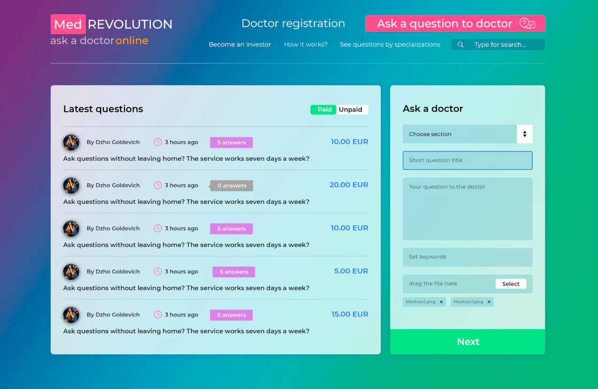

# MED Consultation 
💉 сайт онлайн-консультаций

 

> ⚠️ **ВНИМАНИЕ!** ⚠️ Не скачивайте проект. Только для чтения. По некоторым причинам проект устарел. 

## Что это?

Онлайн-консультации у специалистов. Специалист регистрируется на сайте и отвечает на вопросы пользователей в приватном чате. За консультацию пользователь платит деньги. Часть денег от консультаций идет специалисту. 

**Год разработки**: 2019 год

### ✒️ История создания проекта
Это мой проект с прошлой работы. Проект не был доведен до конца по причине поступления отказа от заказчика и был заброшен и забыт. :( 

Это первый проект, который мне доверили на полную разработку. Самым сложным на данном проекте была разработка платежа через coinbase. Просматривая код, можно заметить, как я сомневалась при выборе технологий, копировала свой код из прошлых проектов, как я разрабатывала SPA и так далее.

### 🔎 Почему был выложен этот проект?

1. Во первых, чтобы не потерять, проект уже не существует в Bitbacket, репрозиторий был удален владельцем - бывшим коллегой и начальником. Тем не менее, проект был разработан мной и мне не хочется терять свои наработки.
2. Во вторых, репрозиторий создан для истории. По коду в проекте можно понять, какой стиль кода был у меня в 2019 году и как он изменился за эти годы.
3. В третих, репрозиторий выложен в публичный доступ для показа своих возможностей будущим работодателям и всем интересующимся

## Технологии
node/express/ejs, vue.js, mysql, coinbase

## Требования

- npm v6.10.0
- node v12.7.0
- Проект запускался на windows с использованием программы webstorm

## Установка

Если вы все же решили установить проект, будьте готовы к ошибкам:
- Проект был создан на старой версии npm, при `npm install` могут возникнуть конфликты. 
- Проект зависим от БД, в том числе главная страница будет отображаться неправильно из-за нехватки информации. Установите заглушки на свое усмотрение.
- Могут возникнуть дополнительные ошибки, дальше главной я не проверяла

### Инструкция:

1. `npm install`
2. `node app.js`

## TODO
- [ ] Обновить проект, чтобы он запускался
- [ ] Добавить заглушки для зависящих от БД
- [ ] Проверить сайт на ошибки
